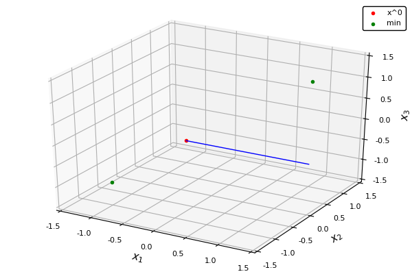

## Powell's example of cyclic non-convergence in coordinate descent.

Consider the objective function: 

```
	f(x,y,z) = -xy -yz -xz + (x-1)^2 + (-x-1)^2 + (y-1)^2 + (-y-1)^2 + (z-1)^2 + (-z-1)^2 .
```

It can be shown that the minimizers of this function are the two points: [1, 1, 1] and [-1, -1, -1]. Exact minimization with respect to each coordinate yields the following solutions:
```
	x <- (1 + |y + z|/2)*sign(y + z)
	y <- (1 + |x + z|/2)*sign(x + z)
	z <- (1 + |x + y|/2)*sign(x + y)
```

If one starts the coordinate descent procedure at the point [-1 - ϵ, 1 + ϵ/2, -1 - ϵ/4] for a small number ϵ, and updates the coordinates in x,y,z order, then the optimization procedure will not converge. It cycles around the other vertices of the [-1, 1] cube, as shown in the animation below.



The example is just to show that exact CD will not necessarily converge. One can enforce convergence in this function by randomly selecting the coordinate to be updated or by using a gradient-based update.

### References

- [Powell, MJD (1973), On search directions for minimization algorithms, _Mathematical Programming_ 4, pp 193-201 (Eq. 2)](https://link.springer.com/article/10.1007%2FBF01584660)
- [Wright, SJ (2015), Coordinate descent algorithms, _Mathematical Programming_ 151, pp 3-34 (Sec. 3.1)](https://link.springer.com/article/10.1007/s10107-015-0892-3)